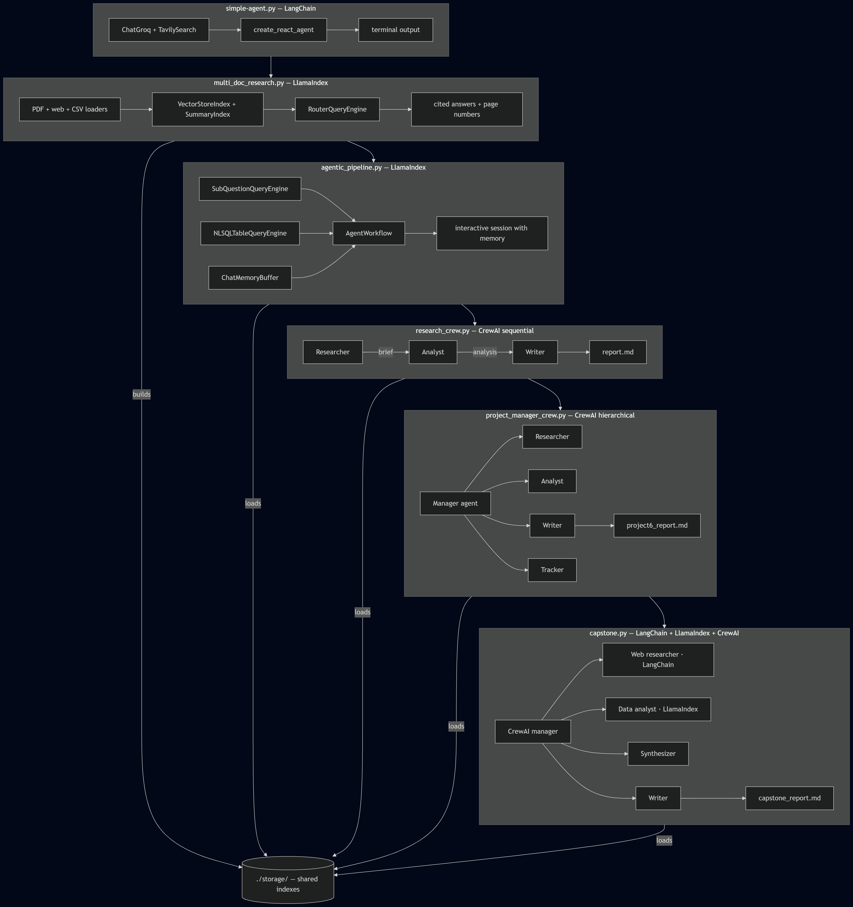

# Agent Workflows

A progression of five AI agent projects built with LangChain, LlamaIndex, and CrewAI — from a single tool-calling agent to a multi-framework pipeline that combines all three. Each project is self-contained and introduces one new layer of complexity. All projects use Groq's free API tier and require no paid OpenAI access.



## Projects

| File | Framework | Concept |
|---|---|---|
| `simple-agent.py` | LangChain + LangGraph | ReAct agent with web search and a custom tool |
| `multi_doc_research.py` | LlamaIndex | RAG over PDF, web, and CSV with router-based source selection |
| `agentic_pipeline.py` | LlamaIndex | Sub-question decomposition, SQL over CSV, agent memory |
| `research_crew.py` | CrewAI | Sequential multi-agent crew: researcher, analyst, writer |
| `capstone.py` | LangChain + LlamaIndex + CrewAI | Hierarchical crew where each agent uses a different framework |

Run them in order. Each project builds on the previous one — `agentic_pipeline.py` and all CrewAI projects reuse the vector index built by `multi_doc_research.py`.

## Requirements

Python 3.10 or later. A `.env` file in the project root:

```
GROQ_API_KEY=gsk_...
TAVILY_API_KEY=tvly-...
```

Get a free Groq key at console.groq.com. Get a free Tavily key at tavily.com.

## Install all dependencies at once

```
pip install langgraph langchain-groq langchain-community tavily-python crewai crewai-tools litellm llama-index-core llama-index-llms-groq llama-index-embeddings-huggingface llama-index-readers-file llama-index-readers-web sqlalchemy pandas pypdf beautifulsoup4 python-dotenv
```

## Data setup

Create a `./data/` folder and place your PDF files inside it. The LlamaIndex projects also expect a CSV file at `./data/IndiaAI_BillingAndUsageDailyData.csv` — replace this with any CSV you have. Update the column descriptions in the tool descriptions to match your actual column names.

## Project structure

```
agent-workflows/
├── simple-agent.py
├── multi_doc_research.py
├── agentic_pipeline.py
├── research_crew.py
├── capstone.py
├── .env
├── data/
│   ├── your_paper.pdf
│   └── your_data.csv
├── storage/           (auto-created by multi_doc_research.py)
│   ├── pdf_vector/
│   ├── web/
│   └── csv/
└── output/            (auto-created, stores generated reports)
```

## Groq rate limits

All five projects use Groq's free tier. The main limits are 30 requests per minute and 100,000 tokens per day for `llama-3.3-70b-versatile`. The CrewAI projects set conservative `max_rpm` values and add sleep between tasks to avoid hitting these limits. If you see 429 errors, wait a minute and retry — the scripts handle this automatically where possible.

## Key concepts by project

`simple-agent.py` shows the ReAct loop: the agent reasons, calls a tool, observes the result, and loops until it has an answer. The `@tool` decorator and tool descriptions are the primary interface.

`multi_doc_research.py` introduces embedding-based retrieval, chunking tradeoffs, and router-based source selection. The `RouterQueryEngine` is the core abstraction — it picks the right source per question rather than searching everything.

`agentic_pipeline.py` shows how to decompose complex questions into sub-questions, execute SQL over structured data, and maintain conversation state across turns. The `AgentWorkflow` replaces the older `ReActAgent.from_tools()` API.

`research_crew.py` introduces the agent-task separation in CrewAI. Agents define who does the work. Tasks define what work needs to be done. Sequential process means outputs chain automatically.

`capstone.py` shows the integration pattern: wrap any framework's functionality in a `BaseTool._run()` method and it becomes a CrewAI-compatible tool. The hierarchical crew adds a manager layer that handles delegation and validation dynamically.